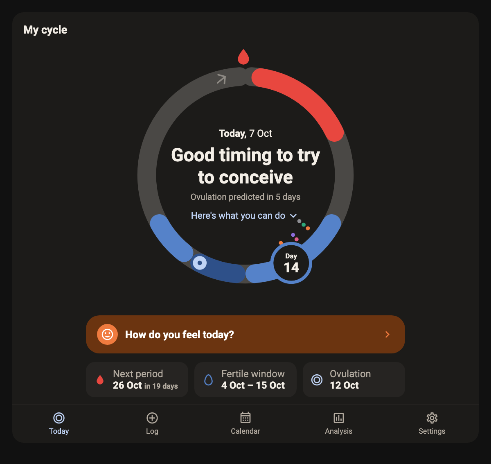
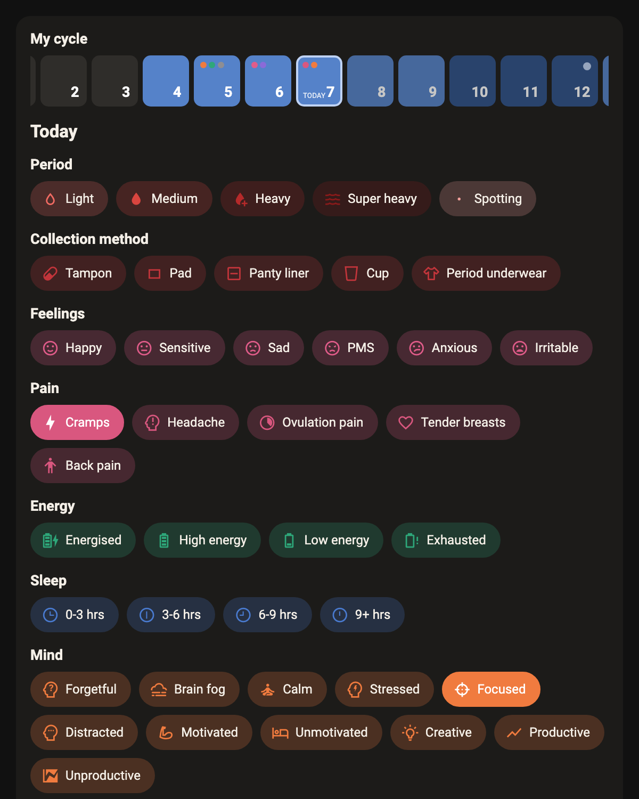
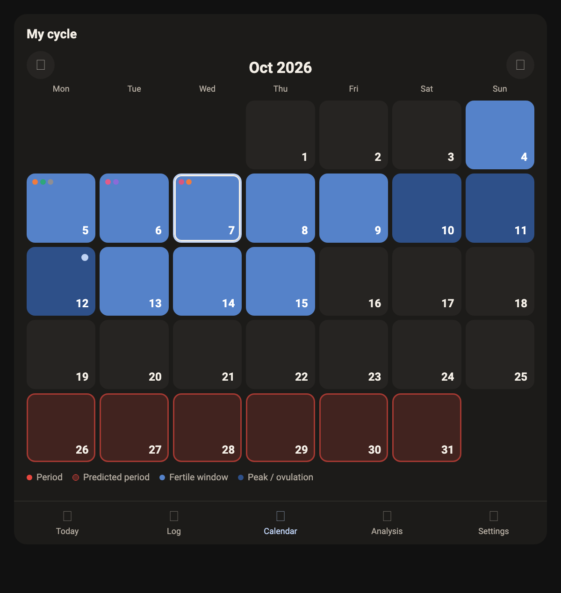
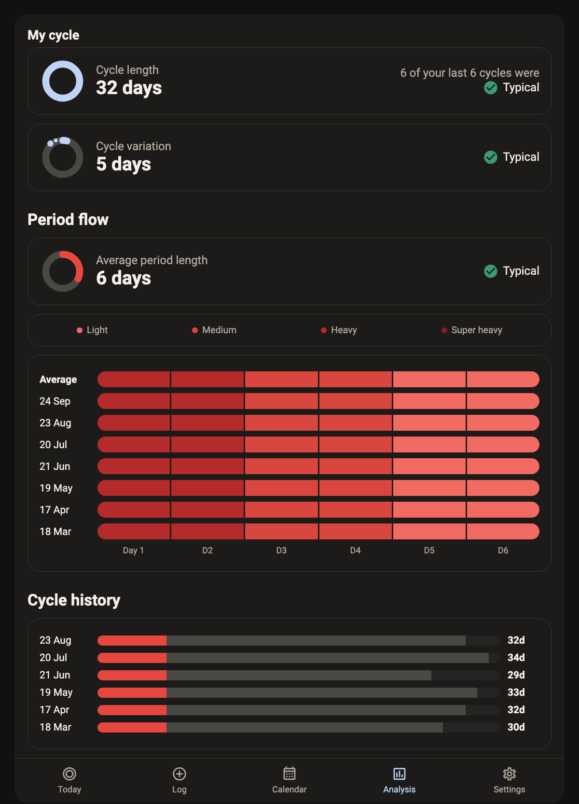
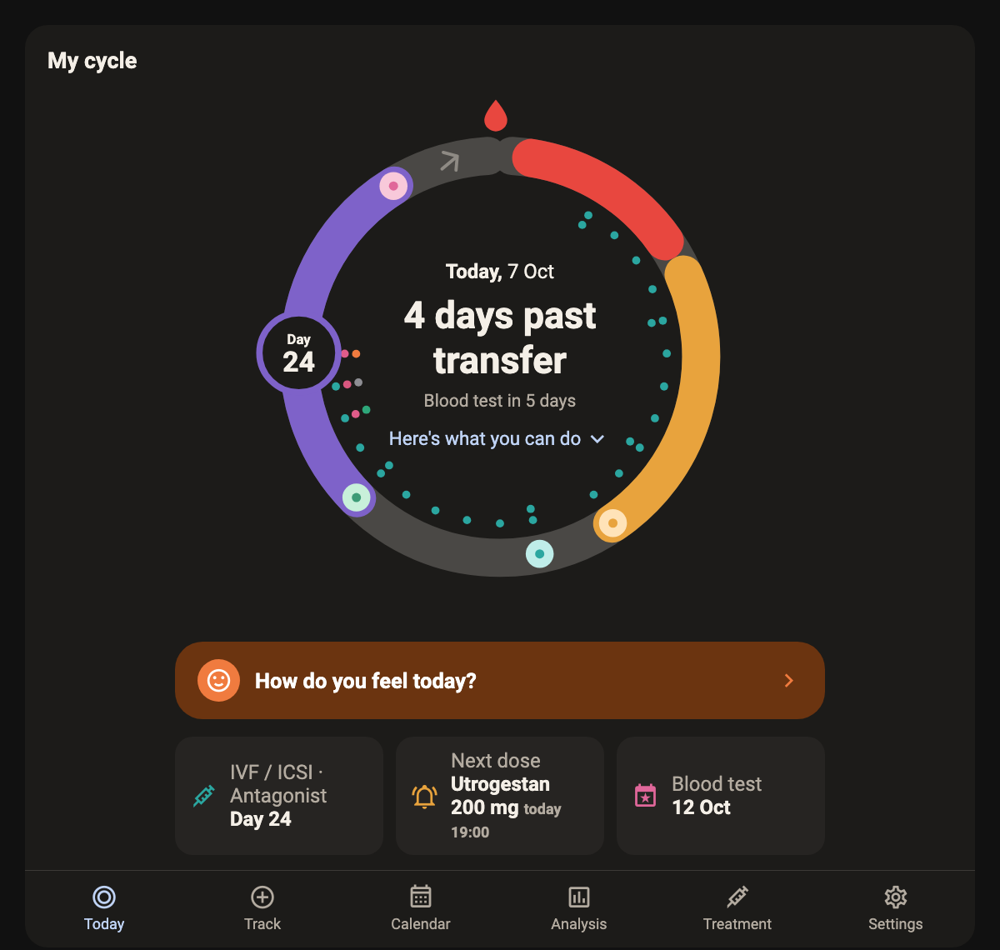
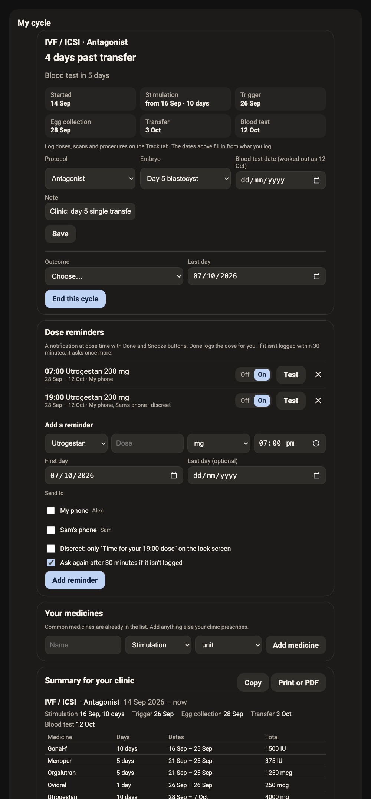
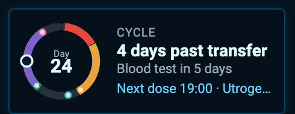

# Clue Cycle - a private cycle tracker for Home Assistant

[](LICENSE)
[](https://github.com/custom-components/hacs)
[](https://github.com/ClermontDigital/ClueCycle)

A period and cycle tracker that looks and works like the Clue app, where every bit of data stays in
your own Home Assistant. It has the cycle ring, daily logging with the same categories and tags,
predictions for the next period and the fertile window, and Clue's analysis screens. You can bring
your history across from a Clue data export.

## 🔐 Your data stays yours

**This is the big difference from the Clue app.** With Clue, your cycle history lives on someone
else's servers, under their terms, and getting it back out means asking for an export. With Clue
Cycle, every period, symptom, note and test result is stored in **your own Home Assistant**, on
your own hardware:

- **No account, no cloud, no company in between.** Nothing is sent anywhere. There's no telemetry,
  no ads, and nobody who can sell, share or be made to hand over your data.
- **Private even inside your home.** Each tracker is visible only to its owner unless they choose to
  share it. Not even Home Assistant admins can read it through the app.
- **It goes where your Home Assistant goes.** It's included in your normal Home Assistant backups,
  and it doesn't disappear if an app shuts down or changes its pricing.
- **Bring your history with you.** Import everything from Clue's "Download my data", and keep
  tracking the way you're used to.

> **Unofficial.** Clue Cycle is not made by, affiliated with or endorsed by Clue or BioWink GmbH.
> "Clue" is used only to describe what it imitates.
>
> **Not medical advice, and not contraception.** Predictions are estimates from your logged history.
> Don't use them to prevent pregnancy. Talk to a doctor about anything that worries you.

## Features

- ⭕ **The cycle ring.** Today's cycle day sits on a ring that shows your period, predicted period,
  fertile window, peak days and estimated ovulation. Each logged day carries coloured dots. The
  middle says where you are, for example "Good timing to try to conceive" or "Period expected in 3 days",
  with tips for that phase.
- 📝 **Track, Clue style.** Log period flow, sex and sex drive, collection method, feelings, pain,
  energy, sleep and sleep quality, mind, social life, cravings, digestion, poop, discharge, tests,
  birth control, skin, hair, exercise, party, leisure, ailments, medication and appointments.
  The options use the same names as Clue's own data export. You also get your own **tags** and a
  note for each day. Logging works for any day, past or future. Each category folds down to one
  row that shows what's logged, and **Edit categories** hides the ones you don't use and reorders
  the rest.
- 📅 **Calendar.** A month view with logged and predicted periods, the fertile window and ovulation.
- 📊 **Analysis.** Cycle length (and how many recent cycles were typical), cycle variation,
  average period length, period flow per cycle, and cycle history.
- 🔮 **Predictions.** Predictions come from the last six cycles, the way Clue does it. The next
  period uses your average cycle length. The fertile window is built from your shortest and longest
  cycles. Ovulation is one luteal phase (14 days, adjustable) before the next period. A late period
  is shown as late; the cycle is not silently moved.
- 📥 **Import from Clue.** Choose the zip from Clue's **Download my data** in the card, and enter
  the password from Clue's email. You'll see a preview of what will come across before anything is
  saved.
- 💉 **Fertility treatment (optional).** For IVF, frozen embryo transfer, IUI, egg freezing and
  ovulation induction. Log doses, scans, procedures and results; get dose reminders on your phone
  with a **Done** button; and keep a summary for your clinic. See
  [Fertility treatment](#fertility-treatment).
- 🔔 **Cycle notifications.** A phone notification when your phase changes, for example when your
  fertile window starts or your period is due.
- 👥 **Multi-user, private by default.** See [Privacy and sharing](#privacy-and-sharing).
- 🧩 **Optional sensors and a calendar** for your own automations. They are off by default, for a
  reason explained below.
- 🚀 **HACS ready.** No YAML, no add-on, no cloud, no extra database.

## Screenshots

These were made with made-up history, not anyone's real data.

**Today.** The ring shows where you are in your cycle, with the next period, the fertile window and
ovulation underneath. Tap the day marker, or "How do you feel today?", to log.



**Track.** Use the day strip to pick any day. Each category is one row showing what's logged that day;
tap it to open the chips. Period, and anything logged that day, start open. **Edit categories** hides the
categories you don't use under "More categories" and changes the order.



**Calendar.**



**Analysis.**



**Fertility treatment.** While a treatment cycle runs, the ring follows it. It shows the
stimulation days (amber), the trigger, egg collection and transfer markers, and the wait to the
blood test (purple). Underneath, it shows the next dose and the next milestone.



**The Treatment tab** has the cycle's key dates, dose reminders, your own medicines and the summary
for your clinic.



## Installation

### Requirements
- Home Assistant 2025.1 or newer
- HACS, for the easy route

### HACS
1. In HACS, open the menu and choose **Custom repositories**. Add
   `https://github.com/ClermontDigital/ClueCycle` with the category **Integration**.
2. Install **Clue Cycle**, then restart Home Assistant.
3. Go to **Settings → Devices & services → Add integration → Clue Cycle**.

### Manual
Copy `custom_components/clue_cycle/` into `/config/custom_components/` and restart Home Assistant.

### Adding a tracker
Each person gets their own tracker. When you add the integration, you choose:

- **Name.** It's shown on the card, for example "Alex's cycle".
- **Owner.** This is the Home Assistant user the tracker belongs to. Only the owner can change
  its settings or decide who else sees it.
- **Goal.** *Trying to conceive* or *Track my cycle*. This changes the wording on the ring.
- **Usual cycle and period length.** These are used only until a few cycles have been logged or
  imported.

### The card
The integration serves its own card and registers it as a dashboard resource for you. Add it to
any dashboard:

```yaml
type: custom:clue-cycle-card
```

| Option     | Default   | Description                                                                 |
|------------|-----------|-----------------------------------------------------------------------------|
| `entry_id` | first one | Which tracker to open, if the person viewing can see more than one.         |
| `view`     | `today`   | The tab to open on: `today`, `track`, `calendar`, `analysis`, `treatment` or `settings`. Or `mini` for the compact widget below. |
| `title`    | `Cycle`   | `mini` only: the small heading. |
| `theme`    | `clue`    | `mini` only: `clue`, or `glass` (dark navy with a cyan edge, for tron-style dashboards). |
| `navigation_path` | none | `mini` only: where tapping the widget goes, for example `/dashboard-cycle/cycle`. |

The card works best in a **Panel** view, or a Sections view with the card set to full width.

**The compact widget.** `view: mini` shows a small ring with the cycle day, the ring's headline and
the next milestone (next period, or the next dose or procedure during treatment). It's useful on a home
or wall-panel dashboard. Like the full card, it only shows a tracker that the person looking can see.

```yaml
type: custom:clue-cycle-card
view: mini
theme: glass
navigation_path: /dashboard-cycle/cycle
```



## Privacy and sharing

Cycle data is personal, so Clue Cycle is careful about who can see it:

- **Private by default.** A new tracker is visible only to its owner. That includes other
  Home Assistant administrators: everything goes through the integration's own API, which checks
  who is asking on every request.
- **The owner chooses who else sees it.** They do this in the card's **Settings → Who can see this**.
  Every other user can be set to:
  - **Hidden.** The tracker doesn't exist for them.
  - **Can view.** They see the ring, the log, the calendar and the analysis, but can't change anything.
  - **Can edit.** They can also log days, manage tags and import. Use this for a partner who logs on
    your behalf. Each day records who last changed it.
- **Only the owner changes settings or sharing.** Someone with edit access can't share the tracker
  further or change the cycle settings.
- **Sensors are off by default.** Home Assistant entities are visible to every user, and their
  state is kept in history, so they are opt-in. When the owner turns them on, the tracker adds the
  entities listed below.
- **Storage.** Data is kept in Home Assistant's `.storage/clue_cycle.<entry_id>` and is included
  in your Home Assistant backups. Deleting the tracker deletes its data.

Asking about a tracker you can't see returns the same answer as asking about one that doesn't
exist, so other users can't even find out that it's there.

What this can't protect against: anyone with access to the Home Assistant host's files or backups
can read the storage file. Administrators can also see that a tracker exists under
**Devices & services**, and can change its usual lengths there, though not its data or sharing.
Choose who has admin and host access accordingly.

## Notifications

Notifications go to the Home Assistant companion app. They can only be sent to the phones of people
who can see the tracker, and that's checked again every time one is sent. So if you stop sharing with
someone, their phone stops getting your notifications too.

**Cycle notifications** are set by the owner in **Settings → Cycle notifications**. Once a day, at
the time you choose (08:00 by default), Clue Cycle checks your phase. If it has changed since the
last notification, it sends the same words as the middle of the ring, for example "Good timing to try
to conceive" or "Period expected today". A period you've already logged doesn't get a notification.
**Discreet** mode shows only "There's an update on your cycle" on the lock screen.

**The daily reminder** asks "How do you feel today?", like Clue's own reminder, at a time you choose
(12:00 by default). Tapping it opens the tracker on the Track tab. By default it's skipped on days
something has already been logged. Anyone who can edit the tracker can set it up in **Settings → Daily reminder**.

**"Your phones"** (or "*owner*'s phones") is a recipient you can tick for any of these notifications. It
means the owner's phones and tablets (not Macs) at the moment each notification goes out. A phone
they sign in on later is included without changing anything.

**Admins** can also switch on the owner's cycle notifications and daily reminder under
**Settings → Devices & services → Clue Cycle → Configure**, for example for someone who hasn't
opened their tracker yet. These only ever go to the owner's own phones, so the admin still can't see
anything. The owner can change or turn them off in their card's Settings.

**Dose reminders** are on the Treatment tab and are described below.

## Fertility treatment

Turn this on in **Settings → Fertility treatment** (owner). It adds a **Treatment** tab, and adds a
**Treatment** section to Track with procedures, medicines and results.

- **Start a treatment cycle** with its type, protocol, first day and, if you know them, the embryo
  day and blood test date. While it runs, natural predictions pause and the ring follows the
  treatment instead. When you end it with an outcome, natural predictions carry on from your next
  period. Treatment cycles are always left out of your natural averages.
- **Log as you go on Track.** Procedures are chips: baseline and monitoring scans, blood tests,
  trigger shot, egg collection, fresh or frozen transfer, IUI, pregnancy blood test and pregnancy
  scan. **Medicines** are doses with an amount, unit and time. **Results** are numbers: follicles,
  lining, oestradiol, progesterone, LH, eggs collected, mature, fertilised, blastocysts, embryos
  transferred and frozen, and hCG.
- **The timeline fills in from what you log.** Stimulation starts with the first stimulation dose.
  The trigger is the trigger shot or a trigger medicine. Egg collection is expected 2 days after the
  trigger. The blood test defaults to 9 days after a day 5 or 6 transfer, 11 days after a day 3
  transfer, or 14 days after an IUI. Clinics vary, so you can set the test date yourself.
- **Medicines.** Medicines common in Australian clinics are built in: Gonal-f, Puregon, Rekovelle,
  Elonva, Menopur, Pergoveris, Clomid, letrozole, Orgalutran, Cetrotide, Lucrin, Synarel, Ovidrel,
  Pregnyl, Decapeptyl, Crinone, Utrogestan, Prolutex, progesterone in oil, Progynova, Estradot,
  Estrogel, aspirin, Clexane, prednisolone, doxycycline, metformin and prenatal vitamins. Add
  anything else under **Your medicines**.
- **Dose reminders.** A reminder has a medicine, dose, time, first and last day, and phones. At
  the dose time the phones get a notification with **Done** and **Snooze 15 min** buttons. Done logs
  the dose. If nothing has been logged after 30 minutes, it asks once more. A dose you've already
  logged doesn't trigger the reminder. Partners who give the injections can be added if the tracker
  is shared with them. **Discreet** shows only "Time for your 19:00 dose".
- **Summary for your clinic.** Each treatment cycle shows its dates, each medicine's days and total
  dose, the procedures and the results. Use **Copy** or **Print or PDF**.

Always follow your clinic's instructions. This only keeps track.

## Sensors and calendar (optional)

These are created only when the owner turns on **Home Assistant sensors** in the card's settings:

| Entity | What it is |
|---|---|
| `sensor.<name>_cycle_day` | Day of the current cycle |
| `sensor.<name>_cycle_phase` | `period`, `follicular`, `fertile`, `fertile_peak`, `ovulation`, `luteal`, `pms`, `due`, `late`, `treatment` |
| `sensor.<name>_next_period` | Date the next period is expected |
| `sensor.<name>_days_until_period` | Days until then |
| `sensor.<name>_ovulation` | Estimated ovulation date |
| `sensor.<name>_fertile_window_start` / `_end` | The fertile window |
| `sensor.<name>_average_cycle_length` | Over the last six cycles |
| `sensor.<name>_average_period_length` | Over the last six periods |
| `sensor.<name>_cycle_variation` | Longest minus shortest of the last six cycles |
| `binary_sensor.<name>_on_period` | On during a period |
| `binary_sensor.<name>_fertile_window` | On during the fertile window |
| `calendar.<name>_cycle` | Logged and predicted periods, fertile windows and ovulation |

They update as soon as anything is logged, and again at midnight.

## Importing from Clue

1. In the Clue app, use **Download my data**. Clue emails you a password-protected zip
   (`ClueDataDownload-<date>.zip`) and the password for it.
2. In the card, open **Settings → Import from Clue** and choose the zip. When it asks, enter the
   password from Clue's email. The older `.cluedata` backup and a bare `measurements.json` work too.
3. Check the preview. It shows how many days, the date range, how many tags, and anything it didn't
   recognise. Then press **Import**. Only `measurements.json` is read from the zip; the account,
   subscription and doctor-report files in it are ignored.

Data synced from a wearable (resting heart rate, heart rate variability) and weight are not
imported, and the preview lists them as not tracked here.

Importing merges into what's already there, day by day, and imported values win. You can run it
again safely. The file and its password are sent from your browser to Home Assistant over the existing
authenticated connection. Neither is written to disk or logged.

## How predictions work

- A **period** is a run of days logged with light, medium, heavy or super heavy flow. Gaps of up
  to two days are allowed. Spotting doesn't start or extend a period.
- A **cycle** runs from the first day of one period to the day before the next.
- The **averages** use your last six complete cycles. Until you have some, your usual lengths from
  settings are used.
- **Typical ranges** follow Clue: a cycle of 21 to 35 days, a period of 2 to 7 days, and a
  variation of up to 7 days.
- **Ovulation** is estimated as cycle start + (average cycle length − luteal phase).
- The **fertile window** runs from 5 days before the earliest likely ovulation, using your shortest
  recent cycle, to 1 day after the latest, using your longest. Peak fertility is the two days before
  ovulation and ovulation itself.
- Past cycles get an **estimated ovulation** from when the next period actually started.
- A "cycle" longer than 90 days is almost always months where nothing was logged, so it's shown as a
  **gap** in the history and left out of the averages.

## WebSocket API

The card talks to Home Assistant only through these commands, and each one checks the caller's
role. They're documented here for anyone building something else on top.

| Command | Role | Purpose |
|---|---|---|
| `clue_cycle/trackers` | any | Trackers the caller can see, and their role on each |
| `clue_cycle/categories` | any | The logging categories and options |
| `clue_cycle/overview` | view | Ring, prediction, status, stats and tags |
| `clue_cycle/days` | view | Day logs between two dates |
| `clue_cycle/calendar` | view | Per-day colouring between two dates (max 400 days) |
| `clue_cycle/analysis` | view | Stats and every cycle |
| `clue_cycle/subscribe` | view | Pushes an event whenever the tracker changes |
| `clue_cycle/set_day` | edit | Log or clear values on a day |
| `clue_cycle/tag_add` / `tag_remove` | edit | Manage "My tags" |
| `clue_cycle/import` | edit | Import a Clue export (`dry_run` for a preview) |
| `clue_cycle/layout_set` | edit | Track tab: category order and hidden categories |
| `clue_cycle/settings_set` | owner | Goal, usual lengths, treatment tracking and cycle notifications |
| `clue_cycle/sharing` / `sharing_set` | owner | Who can see or edit, and whether sensors are on |
| `clue_cycle/treatment_info` | view | Medicines, form choices and treatment cycles |
| `clue_cycle/treatment_summary` | view | The summary for the clinic |
| `clue_cycle/dose_add` / `dose_remove` | edit | Log or remove a dose on a day |
| `clue_cycle/med_add` / `med_remove` | edit | Your own medicines |
| `clue_cycle/treatment_start` / `treatment_update` / `treatment_delete` | edit | Treatment cycles |
| `clue_cycle/schedules` / `schedule_set` / `schedule_remove` | edit | Dose reminders, and the phones they can go to |
| `clue_cycle/notify_test` | edit / owner | A test reminder (edit), or a test cycle notification (owner) |

## Development

```bash
python3 -m venv .venv && .venv/bin/pip install -r requirements_test.txt
.venv/bin/pytest -q
```

The card is a single buildless file, `custom_components/clue_cycle/www/clue-cycle-card.js`. The
cycle maths lives in `engine.py`, which is plain Python and has no Home Assistant imports.

## Issues and contributions

Bugs and ideas go in the [issue tracker](https://github.com/ClermontDigital/ClueCycle/issues).
**Please don't attach your own export or screenshots that show real cycle data.**

## License

Apache 2.0. See [LICENSE](LICENSE).
